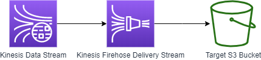

# Simple use case with Kinesis

## Architecture

## Run

### Create CloudFormation Stack

Create resources using CloudFormation template: [template.yml](template.yml).

### Generatate test data to Kinesis source stream

Generate sample data to Kinesis using tool https://awslabs.github.io/amazon-kinesis-data-generator/web/producer.html

#### Configure account

Create an Amazon Cognito User, follow instruction from: https://awslabs.github.io/amazon-kinesis-data-generator/web/help.html

### Start data generation

TODO